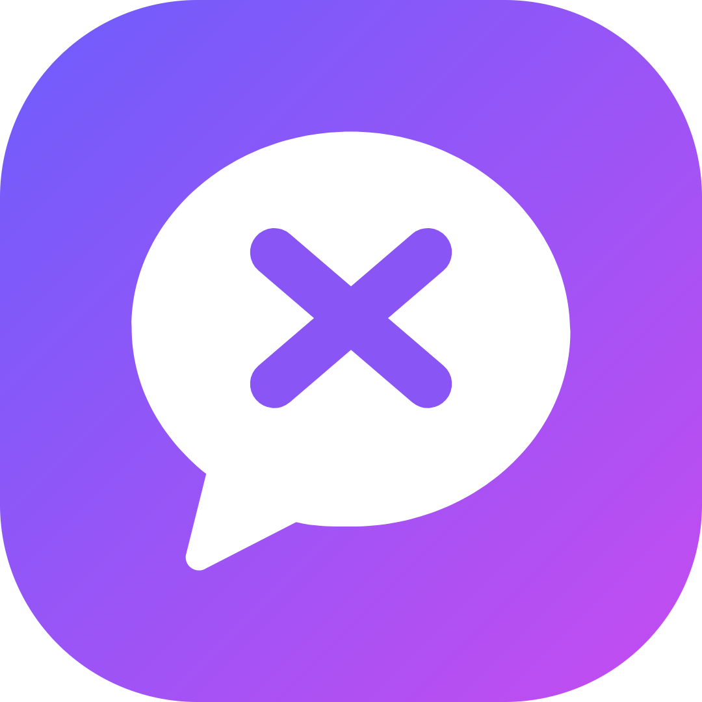
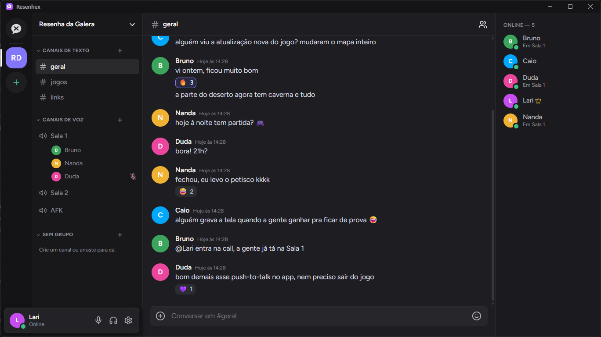
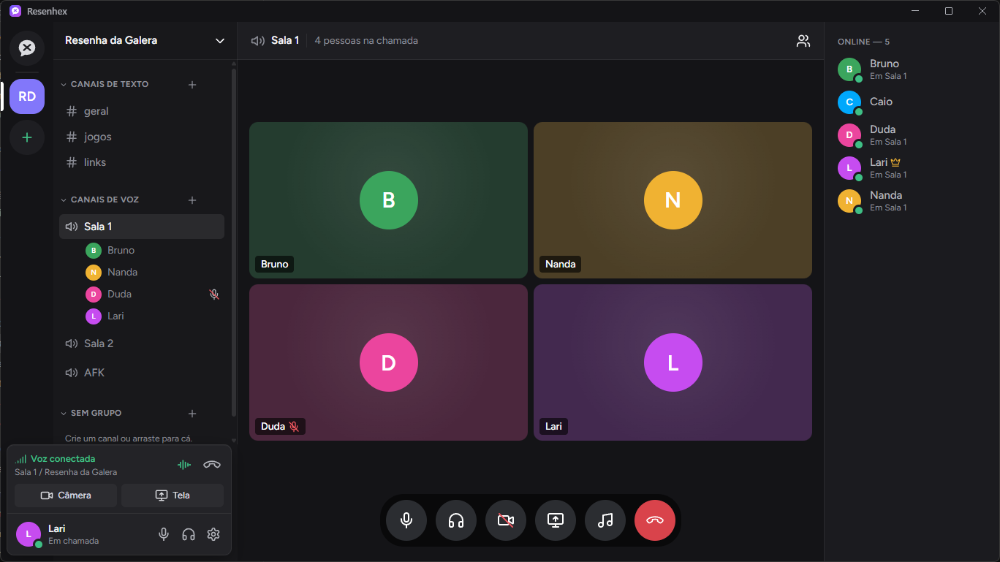

<div align="center">



# Resenhex

Plataforma própria de chat, voz, vídeo e compartilhamento de tela em tempo real, inspirada no Discord.<br>
Roda no navegador, como app para Windows (publicado na Microsoft Store) e como app para Android, baixado do próprio site.

[](https://apps.microsoft.com/detail/9NG3QRZSB1LX)


</div>

<p align="center">
  
</p>

## Sobre o projeto

O Resenhex é um produto completo, usado no dia a dia por um grupo de amigos: servidor próprio na nuvem, cliente web, app desktop com atualização automática e publicação na Microsoft Store. Foi construído do zero, do protocolo de tempo real à interface.

## Destaques técnicos

- **Tempo real:** mensagens, presença, digitação e estado das chamadas sincronizados via Socket.IO, com reconexão automática que recupera as mensagens perdidas e devolve o usuário à chamada.
- **Voz, câmera e tela:** chamadas WebRTC com conexão direta entre os participantes ou por servidor de mídia (LiveKit SFU), perfis de qualidade até 1080p 60 fps, áudio do sistema e supressão de ruído por IA rodando no próprio cliente.
- **App desktop:** casca em Electron com push-to-talk global (funciona dentro de jogos), bandeja do sistema, notificações e atualização automática. Versão empacotada em `.appx` para a Microsoft Store.
- **Comunidades:** vários servidores por conta, convites, cargos e permissões com hierarquia, canais privados e ferramentas de moderação.
- **Recursos sociais:** amigos e mensagens diretas, menções, reações, respostas, envio de arquivos, soundboard, música do YouTube sincronizada para toda a sala e um minijogo em 3D com Three.js.
- **Operação:** deploy automatizado por script em servidor ARM na Oracle Cloud, com proxy reverso, TURN para atravessar redes restritivas e testes automatizados com `node:test`.

<p align="center">
  
</p>

## Tecnologias

| Camada | Tecnologias |
|---|---|
| Servidor | Node.js, Express, Socket.IO |
| Mídia | WebRTC, LiveKit (SFU), coturn |
| Cliente | JavaScript, HTML e CSS sem framework, Three.js |
| Desktop | Electron, electron-builder, electron-updater |
| Infraestrutura | Oracle Cloud (ARM), Caddy, systemd |

## Estrutura

```
discord-clone/
├── server.js          # servidor HTTP e de tempo real
├── *.js               # módulos de domínio: canais, comunidades, DJ, soundboard, chamadas...
├── public/            # cliente web
├── desktop/           # app para Windows (Electron) e pacote da Microsoft Store
├── deploy/            # scripts de instalação, deploy e servidor de mídia
└── test/              # testes automatizados
```

## Como rodar

```bash
cd discord-clone
npm install
npm start
```

O servidor sobe em `http://localhost:3000`. O passo a passo completo, incluindo o app desktop e o deploy, está no [README do app](discord-clone/README.md). O histórico de versões fica no [CHANGELOG](discord-clone/CHANGELOG.md).
