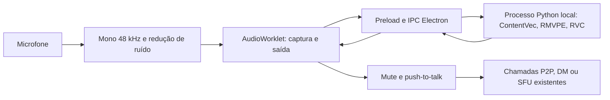

# Voz por IA local

O aplicativo Windows transforma o microfone com RVC/ONNX antes de entregar o áudio às chamadas existentes. O catálogo, o motor, as configurações e os controles estão implementados. A verificação realizada em Linux confirmou inferência real e áudio Electron → navegador, incluindo recuperação de conversão lenta. GPU DirectML e o instalador precisam de validação num Windows real; consulte o [relatório de validação](relatorios/VALIDACAO-VOZ-IA-2026-10-10.md).

## Usar

1. Abra **Configurações → Voz e vídeo → Efeitos de voz** ou o menu de áudio da chamada. Os personagens aparecem junto de Esquilo, Robô e dos outros efeitos; Braum, Zed, Pantheon e Ahri usam retratos locais do Data Dragon.
2. Escolha um personagem. Se necessário, a instalação começa automaticamente e baixa também o encoder correspondente e o extrator de pitch. O painel **Voz por IA** apresenta progresso, cancelamento, remoção e origem dos modelos.
3. Escolha a voz e mantenha **Aceleração: Automático** para priorizar GPU. Ajuste qualidade e tom, se necessário.
4. Use o teste de microfone existente para ouvir a transformação antes da chamada. O teste é local, inclusive quando a chamada está mutada.
5. Salve o efeito nas configurações para ativá-lo na chamada. Voz, aceleração, qualidade e tom são salvos automaticamente; o efeito ligado/desligado acompanha as configurações de áudio existentes.
6. Para desativar, selecione **Sem efeito** ou um dos efeitos anteriores. **Remover** apaga o modelo da voz; componentes comuns permanecem para outras vozes.

Quem recebe a chamada usa o áudio WebRTC/Opus normal e não instala o motor. Navegador e celular não executam conversão. No navegador, o catálogo fica indisponível para transformação.

Estados apresentados: disponível, baixando, carregando e erro. Erro do motor, modelo inválido, fila excessiva ou desempenho insuficiente recuperam a voz normal na mesma saída. Mute, ensurdecer, moderação e push-to-talk continuam controlando essa saída. **Tentar conversão novamente** inicia nova tentativa após ajustar o desempenho.

## Motor e integração



`desktop/lib/voice-engine.js` gerencia o processo oculto, downloads, integridade, preferências e sessões. O worker usa stdin/stdout binário, sem porta HTTP ou dispositivo de áudio próprio. Python, NumPy, SciPy e ONNX Runtime são incluídos como recursos do instalador; o usuário final não precisa instalar Python, pip ou drivers virtuais de áudio. PyTorch é usado somente na geração dos seis modelos de personagem, fora do aplicativo distribuído.

No Windows, ONNX Runtime DirectML prioriza GPUs com DirectX 12 de NVIDIA, AMD e Intel. Automático pode voltar à CPU se o provedor não carregar. Um grafo DirectML pode executar operações individuais em CPU: o nome do backend não certifica que toda a inferência está na GPU. O runtime distribuído utiliza DirectML; CUDA só pode aparecer num runtime de desenvolvimento que a disponibilize.

Cada sessão aceita uma conversão em andamento. Há no máximo duas sessões, permitindo chamada e prévia, três pedidos RPC pendentes e dois blocos na fila de reprodução. Áudio com mais de 650 ms é descartado; sobrecarga repetida recupera a voz normal. Mute e soltura do push-to-talk limpam captura/reprodução e alteram a época do áudio, descartando respostas antigas. A próxima conversão reinicia também o histórico do modelo. Após encerrar as sessões, o worker termina em 15 segundos; navegação, falha do renderer e saída do aplicativo também o encerram.

| Ajuste | Bloco de captura | Contexto de conteúdo/síntese |
| --- | ---: | ---: |
| Menor atraso | 80 ms | 320 ms |
| Menor consumo | 160 ms | 320 ms |
| Equilibrado | 120 ms | 480 ms |
| Mais qualidade | 160 ms | 640 ms |

Os valores são configuração, não promessa de latência. O painel mede o intervalo do primeiro sample capturado à sua saída no AudioWorklet e mostra p95 dos últimos 100 blocos. Esse intervalo inclui captura, comunicação e inferência, mas não rede, jitter do receptor ou reprodução no dispositivo remoto. `RTF` é duração da inferência dividida pela duração do bloco; valores próximos ou superiores a 1 não sustentam áudio contínuo.

**Menor consumo** faz menos inferências por segundo, usando o contexto curto do modo Menor atraso. Isso deixa mais capacidade disponível para o jogo, com blocos de captura maiores. Não garante que uma CPU lenta consiga acompanhar.

As seis vozes de personagem usam síntese limitada pelo campo receptivo de cada camada do vocoder, preservando todo o contexto linguístico, flow e fase do oscilador. Os dois ONNX originais restantes continuam compatíveis com o caminho completo. Threads ociosas do ONNX descansam; pausas abaixo de −80 dBFS só dispensam inferência depois que todo o contexto está quieto. Trocas de tom e perfil reutilizam os grafos carregados, com nova geração e históricos vazios. Reamostragem usa apenas a janela audível e suas margens de filtro. A captura envia um bloco por vez, sem copiar PCM descartado por sobrecarga; estatísticas da interface são atualizadas no máximo quatro vezes por segundo, com erros e ativação imediatos. Comparações e limites estão no [relatório de desempenho](relatorios/DESEMPENHO-VOZ-IA-2026-10-10.md).

ContentVec e RMVPE agora executam em sessões independentes em paralelo na GPU ou em CPUs com pelo menos quatro processadores lógicos. CPUs menores mantêm execução sequencial. A síntese espera ambos; erros drenam o trabalho pendente antes de aceitar outro pedido. Os filtros FIR Kaiser são projetados uma vez por razão/tipo e preservam exatamente os coeficientes anteriores. O decoder binário recebe corpos fragmentados com uma única alocação, evitando cópias repetidas; limites, validação e posse do PCM continuam preservados. A [segunda rodada de desempenho](relatorios/DESEMPENHO-VOZ-IA-RODADA-2-2026-10-10.md) compara esses ajustes com a versão já otimizada e registra a equivalência dos samples.

## Catálogo e arquivos

O catálogo prioriza **Braum, Zed, Pantheon e Ahri**, de League of Legends/Ruined King, e mantém **Kaede**, **Uzuki** e duas vozes femininas comunitárias. Os três primeiros são identificados como inglês na origem; Ahri não informa idioma. Modelos foram convertidos e testados com fala sintética em português, mas sem certificação de semelhança artística ou qualidade para português brasileiro. A origem do treinamento não foi documentada pelos distribuidores. A [pesquisa de personagens conhecidos](relatorios/MODELOS-PERSONAGENS-JOGOS-2026-10-10.md) também registra candidatos de God of War, GTA, Halo, Portal, Mario, The Witcher e Red Dead Redemption. Kratos foi testado separadamente, com divergência de licença entre as fontes; não integra o catálogo ativo.

`desktop/lib/voice-catalog.json` registra origem, condição declarada de distribuição, idioma informado, tamanho, encoder e SHA-256. Os quatro modelos novos registram também personagem e jogo. URLs apontam para revisões imutáveis. Downloads exigem HTTPS, tamanho e hash válidos antes de substituir o arquivo final; cancelamento remove o arquivo parcial. Modelos são revalidados em cada novo carregamento de grafos e reinicialização do motor; ajustes de tom e perfil reutilizam os grafos já verificados em memória. As seis vozes de personagem vêm como ONNX no pacote, sendo copiadas para o diretório do usuário quando escolhidas. As outras duas vozes são baixadas como ONNX. Checkpoints `.pth` não são carregados pelo aplicativo. No build, modelos em ZIP têm o arquivo e o membro `.pth` verificados separadamente por hash; caminhos do ZIP não são extraídos para o sistema de arquivos.

Dados do usuário ficam em `app.getPath('userData')/voice-ai/models`; preferências do motor ficam no armazenamento Electron existente. O aplicativo não grava o microfone ou os resultados da inferência. Os WAVs gerados pelos scripts de validação são arquivos de teste fornecidos explicitamente pelo desenvolvedor.

Para adicionar uma voz, verifique distribuição e idioma, fixe URL/revisão/hash/tamanho e associe o encoder correto. Os schemas suportados são RVC v1/v2 com pitch: `feats/p_len/pitch/pitchf/sid` ou `phone/phone_lengths/pitch/pitchf/ds/rnd`, com 256 ou 768 características. Faça conversão real e avaliação de fala/timbre antes de divulgar o modelo. Esta versão não usa índice de recuperação RVC/Faiss, o que pode limitar a semelhança com algumas vozes.

Avisos e licenças estão em [THIRD-PARTY-NOTICES.md](../desktop/voice-engine/THIRD-PARTY-NOTICES.md). As condições são as declarações dos distribuidores, sem certificação independente dos dados de treinamento.

## Requisitos e tamanho

Alvo: Windows 10 x64, versão 2004/build 19041 ou posterior, e Windows 11 x64; GPU DirectX 12 com driver atualizado. Esses alvos ainda não foram testados fisicamente nesta entrega. Planeje inicialmente 16 GB RAM, GPU com 4 GB VRAM e cerca de 3 GB de disco livre como configuração de teste, não como mínimo certificado. CPU é uma alternativa dependente do desempenho: a CPU de nuvem testada não sustentou tempo real.

Runtime Windows preparado: cerca de 288 MiB; seis vozes incluídas: 635 MiB. O encoder dos personagens de LoL e RMVPE exigem aproximadamente 705 MiB adicionais no primeiro uso; Kaede/Uzuki utilizam outro encoder, aproximadamente 625 MiB com o mesmo RMVPE compartilhado. As vozes femininas compartilham o encoder de LoL. O tamanho comprimido do instalador ainda não foi medido. A estimativa antiga de 107 MB no README descreve o aplicativo sem este runtime.

## Gerar o aplicativo sem publicar

Use um Windows de build com Node 24, Python 3.12 x64, Visual Studio Build Tools com C++ e SDK Windows para o módulo nativo `uiohook-napi` já utilizado pelo push-to-talk. Internet é necessária na preparação inicial. Em PowerShell, dentro de `discord-clone`:

```powershell
npm ci
cd desktop
npm ci
python -m venv .voice-build
.\.voice-build\Scripts\python.exe -m pip install torch==2.6.0 onnx==1.19.1 numpy==2.2.6
$env:RESENHEX_BUILD_PYTHON = (Resolve-Path .\.voice-build\Scripts\python.exe).Path
npm run dist
```

`predist` prepara o runtime com arquivos oficiais fixados por hash e exporta os modelos fixados. Downloads válidos são reutilizados. Arquivos ZIP de origem permanecem no cache de build, sem entrar no aplicativo; somente o ONNX exportado é incluído. O exportador rejeita mudanças no ONNX gerado; não altere hashes para contornar diferenças de ferramenta. É possível copiar os ONNX já verificados desta tarefa para `desktop/voice-engine/models` e reutilizá-los no build Windows. PyTorch não entra no instalador. `dist` utiliza `--publish never`; não execute o script existente `deploy/publicar-app.ps1` para esta entrega local.

Para preparar recursos separadamente:

```powershell
npm run voice:runtime
npm run voice:models
```

O runtime inclui CPython embeddable, os wheels Windows/DirectML e DLLs redistribuíveis Microsoft em modo app-local, sem instalador administrativo separado. `windows-runtime.lock.json` fixa todos os artefatos. `extraResources` inclui runtime, motor, modelos e avisos fora do ASAR.

## Desenvolvimento e verificações

O servidor web precisa servir também os novos arquivos de interface. Para trabalhar apenas localmente, inicie o servidor na pasta `discord-clone` e configure o Electron:

```powershell
$env:RESENHEX_URL = "http://127.0.0.1:3000"
npm start
```

Execute esse último comando na pasta `desktop`, com o servidor aberto em outro terminal. No Windows, o runtime gerado é detectado automaticamente. No Linux de desenvolvimento, defina `RESENHEX_VOICE_PYTHON` com o Python da venv e use Xvfb. `RESENHEX_VOICE_DATA_DIR` permite usar um diretório de modelos de teste; `RESENHEX_USER_DATA_DIR` isola preferências em desenvolvimento.

Verificações básicas:

```bash
npm run check
xvfb-run -a node --test --test-concurrency=1
/workspace/.venvs/resenhex-voice/bin/python -m unittest discover -s desktop/voice-engine -p 'test_*.py'
```

`desktop/tools/benchmark-voice.py` recebe um WAV explícito, modelos e diretório de saída. Ele executa o protocolo e os modelos reais, produzindo WAVs e JSON de duração/RTF. Exemplo no ambiente atual:

```bash
/workspace/.venvs/resenhex-voice/bin/python desktop/tools/benchmark-voice.py \
  /workspace/.cache/resenhex/voice/test-pt-br.wav \
  --models /workspace/.local/share/resenhex/voice-ai/models \
  --output /workspace/.local/share/resenhex/voice-validation/new-run \
  --backend cpu --block-ms 160 --context-ms 320
```

`desktop/tools/check-voice-equivalence.py` compara um worker anterior com o atual usando sementes idênticas somente nos processos de teste. Verifica áudio real, histórico/SOLA e uma nova época silenciosa de mute/PTT nos quatro perfis; `--all-shapes` exercita as nove combinações válidas. O relatório inclui hashes dos workers. O app mantém sua conversão estocástica normal. `tools/benchmark-voice-transport.js` mede o decoder com PCM sintético, pacotes completos e fragmentados; esses números não representam a latência total da chamada. O profiling do worker apresenta `encoderPitch` como duração conjunta das duas etapas sobrepostas.

`tools/voice-ai-electron-smoke.js` exige Playwright, Electron, Chromium, modelos e um WAV mono de teste. Variáveis: `RESENHEX_VOICE_PYTHON`, `RESENHEX_VOICE_DATA_DIR`, `RESENHEX_VOICE_TEST_WAV`; opcionais `CHROMIUM_PATH`, `RESENHEX_VOICE_TEST_BACKEND`, `RESENHEX_VOICE_TEST_MODEL` e `RESENHEX_VOICE_SCREENSHOT` e `RESENHEX_VOICE_MENU_SCREENSHOT`. `RESENHEX_VOICE_TEST_MODEL=braum` testa o personagem em vez de Kaede. O modo padrão **realtime** exige 30 blocos convertidos, reprodução medida dentro do limite e nenhuma recuperação de erro. `RESENHEX_VOICE_TEST_EXPECT=fallback` verifica explicitamente a recuperação em hardware lento, mantendo inferência real via IPC, conexão P2P, recepção Opus e mute. Passar esse modo não certifica conversão contínua em tempo real.

Antes de considerar Windows validado, execute o modo realtime com DirectML nas vozes e perfis escolhidos, ouça português com microfone real, teste durante um jogo, confirme memória/VRAM, mute/PTT global, mudança de microfone, redução de ruído, reconexão e instalação em uma máquina sem Python.
